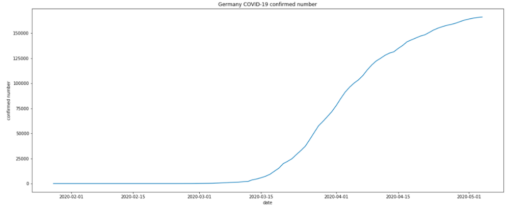
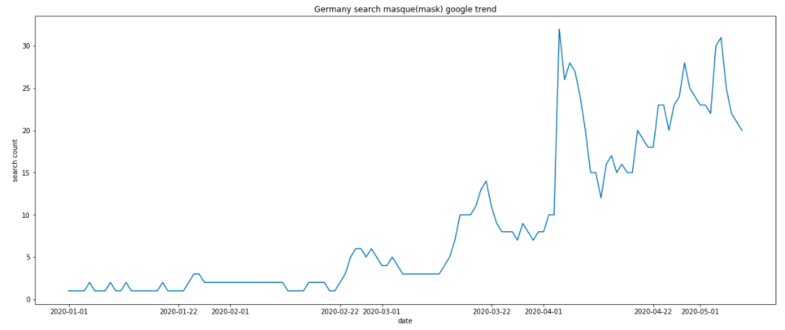
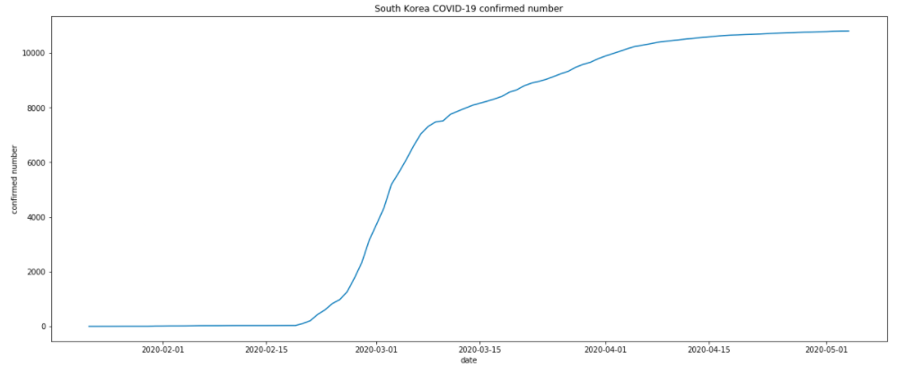
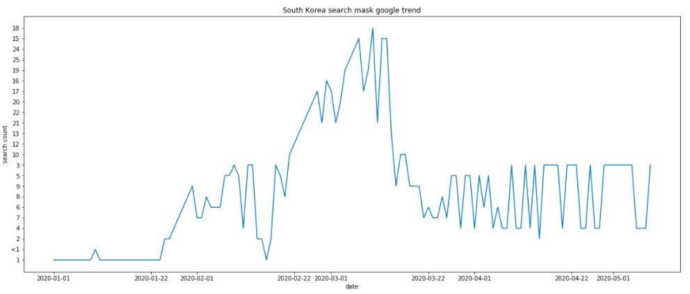

# Different Countries’ COVID-19 trend and policy
This is the final project of IS590PR, this project is Type II

## Purpose
By finding out the relation between each country’s policies and their COVID-19 confirmed rate change, to know which policy, treatment would be the helpful to control the outbreak

## Data Source
https://www.kaggle.com/sudalairajkumar/novel-corona-virus-2019-dataset 
Google Trend

## Hypothesis
(1) Mass test could help decrease the outbreak efficiently  
(2) Countries that people does wearing mask would have lower rate of confirmed number

## Method
Using linear regression to find the obvious slope change
Using data visualization to choose countries that have interesting trend and do deeper investigation

## Result

### Germany
* Confirmed trend

* Mask google trend

Start doing more than 100,000 tests daily at early April  
daily rate of confirmed number: 2990 -> 1780 
 
We use German word --- maske to get the google trend data in Germany.  
We can see that started from early April, the awareness of wearing mask is getting higher in Germany, and thus the confirmed number getting flatten afterwards.

### Korea
* Confirmed trend

* Mask google trend

By mid-March, 270,000 South Koreans had been tested  
daily rate of confirmed number: 482 -> 110 -> 21 
 
We use Korean word --- 마스크 to get the google trend data in South Korea.  
We can see that started from mid March, the awareness of wearing mask is getting higher in South Korea, and thus the confirmed number getting flatten afterwards.

## Conclusion
Hypothesis that mass test would be helpful is valid for Germany, Korea 
Hypothesis that wearing mask would be helpful is valid for Germany, Korea
